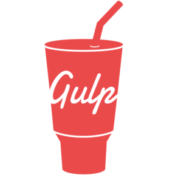

### Hi there, I'm Jasonchen 👋

<!--
#### Profile

-->

#### Stats

>)

#### Visitors

#### QRcode

<!-- ### My Stats: -->
<!-- (https://github.com/Jason-chen-coder) -->

#### Learning

<code></code>
<code></code>

#### Languages

<!-- languages:start -->
<!-- prettier-ignore-start -->
<!-- markdownlint-disable -->
<code></code>
<code></code>
<code></code>
<code></code>
<code></code>
<code></code>
<code></code>
<code></code>
<!-- markdownlint-restore -->
<!-- prettier-ignore-end -->

<!-- languages:end -->

#### Frameworks and Tools

<!-- tools:start -->
<!-- prettier-ignore-start -->
<!-- markdownlint-disable -->
<code></code>
<code></code>
<code></code>
<code></code>
<code></code>
  
<code></code>
<code></code>
  
<code></code>
<code></code>
<code></code>
<code></code>
<code></code>
<!-- <code></code> -->
<!-- <code></code> -->
<!-- <code></code> -->

<!-- markdownlint-restore -->
<!-- prettier-ignore-end -->

<!-- tools:end -->

#### Projects

下面是我在前端工作路上写的一些个人项目和DEMO。

<table>
  <thead align="center">
    <tr>
      <th>项目</th>
      <th>Github</th>
      <th>简述</th>
      <th>技术</th>
      <th>stars</th>
    </tr>
  </thead>
  <tbody align="left">
    <tr>
      <th>
        <a href="https://jason-chen-coder.github.io/Mxgraph-EasyFlowEditor/#/" target="_blank">
        Mxgraph-EasyFlowEditor</a>
      </th>
      <th>
        <a href="https://github.com/Jason-chen-coder/Mxgraph-EasyFlowEditor" target="_blank">Github</a>
      </th>
      <th>Mxgraph流程图编辑器</th>
      <th>
        
        
      </th>
      <th>
        
      </th>
    </tr>
   <tr>
      <th>
        <a href="https://jason-chen-coder.github.io/D3-EasyFlowRender/#/treetopo" target="_blank">
         D3-EasyFlowRender
       </a>
      </th>
      <th>
        <a href="https://github.com/Jason-chen-coder/D3-EasyFlowRender" target="_blank">Github</a>
      </th>
      <th>D3绘制的拓扑图</th>
      <th>
        
         
      </th>
      <th>
        
      </th>
    </tr>
   <tr>
      <th>
        <a href="https://jason-chen-coder.github.io/Monaco-EasyCodeEditor/" target="_blank">
         Monaco-EasyCodeEditor
       </a>
      </th>
      <th>
        <a href="https://github.com/Jason-chen-coder/Monaco-EasyCodeEditor" target="_blank">Github</a>
      </th>
      <th>基于Monaco设计的在线代码编辑工具</th>
      <th>
        
        
      </th>
      <th>
        
      </th>
    </tr>
   <tr>
      <th>
        <a href="https://jason-chen-coder.github.io/JsPlumb-EasyFlowEditor/" target="_blank">
         JsPlumb-EasyFlowEditor
       </a>
      </th>
      <th>
        <a href="https://github.com/Jason-chen-coder/JsPlumb-EasyFlowEditor" target="_blank">Github</a>
      </th>
      <th>Jsplumb流程图绘制工具</th>
      <th>
        
        
      </th>
      <th>
        
      </th>
    </tr>
   <tr>
      <th>
        <a href="https://github.com/Jason-chen-coder/Webpack5Mfp-Node-Nacos" target="_blank">
         Webpack5Mfp-Node-Nacos
       </a>
      </th>
      <th>
        <a href="https://github.com/Jason-chen-coder/Webpack5Mfp-Node-Nacos" target="_blank">Github</a>
      </th>
      <th>Webpack5模块联邦+Node.js+Nacos微前端实践</th>
      <th>
        
        
      </th>
      <th>
        
      </th>
    </tr>
    <tr>
      <th>
        <a href="https://jason-chen-coder.github.io/Xlsx-EasyExportExcelWithChars" target="_blank">
         Xlsx-EasyExportExcelWithChars
       </a>
      </th>
      <th>
        <a href="https://github.com/Jason-chen-coder/Xlsx-EasyExportExcelWithChars" target="_blank">Github</a>
      </th>
      <th>web导出Excel表格并带上图表</th>
      <th>
        
       
      </th>
      <th>
        
      </th>
    </tr>
  </tbody>
</table>
 
<!--  -->

<!-- ### Top Langs:

 -->
<!-- ### Top Projects:

 -->
<!-- ### 📈 Activity Graph：

 -->
